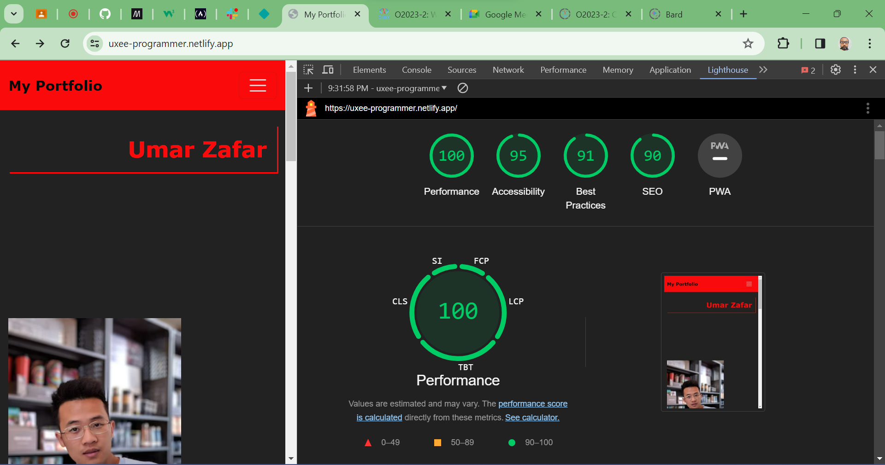
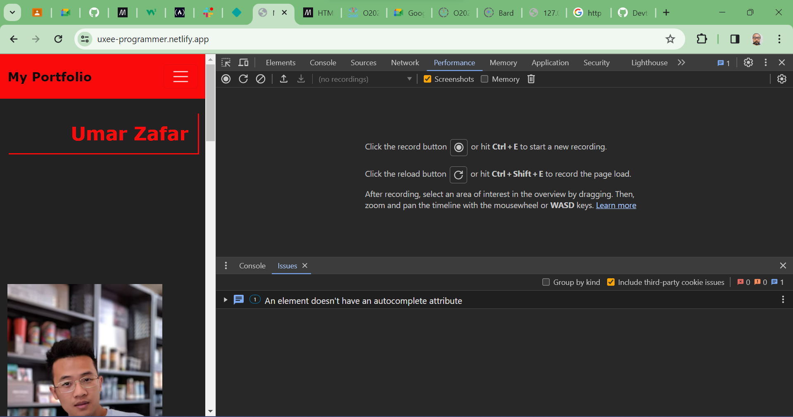
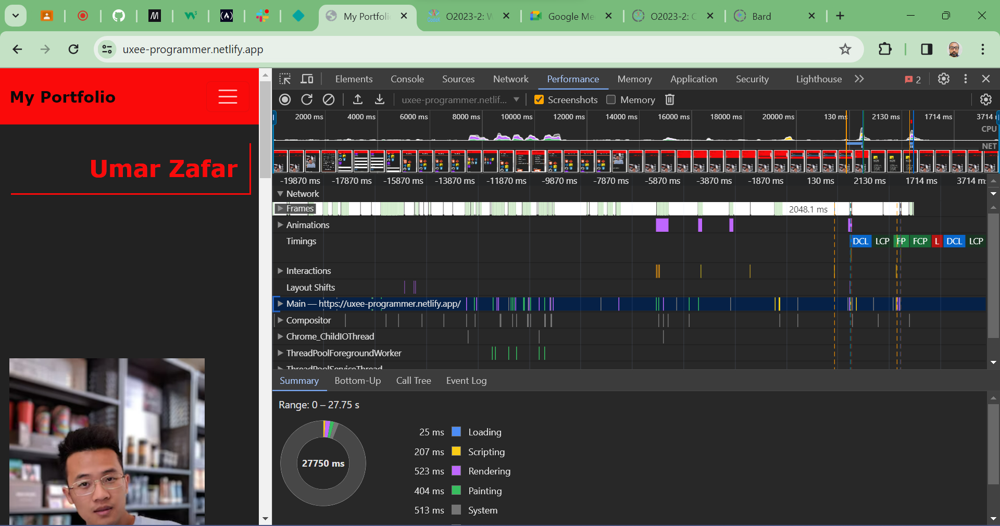
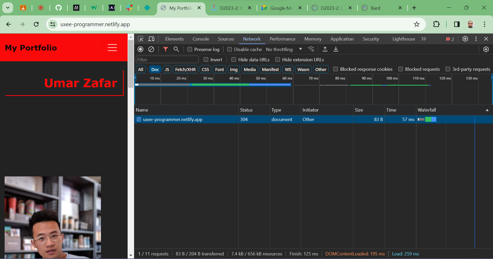

# Web Performance Optimization

## Lighthouse Audit
 Ran Lighthouse audit on my portfolio main page and captured the results of it.  
 I was able to see minor issues with the code in index.html file where Form element for= First name was written in lowercase while id was as First Name in uppercase which i fixed and it resolved the issue showing in the screenshot on the top right side as a small red message icon. Good use of Debugging tool to find even minor errors in the code.

Screenshot attached

Screenshot of the page after fixing the bug in the code in index.html

## Performance Profiling
 Ran Performance profile and recorded its results.

Screenshot attached

## Network performance
 Ran network performance test and recorded its results.

Screenshot attached

Overall the main page is working good according to the test results. No particular performance issues found, SEO and accessibilty score is good as well. 